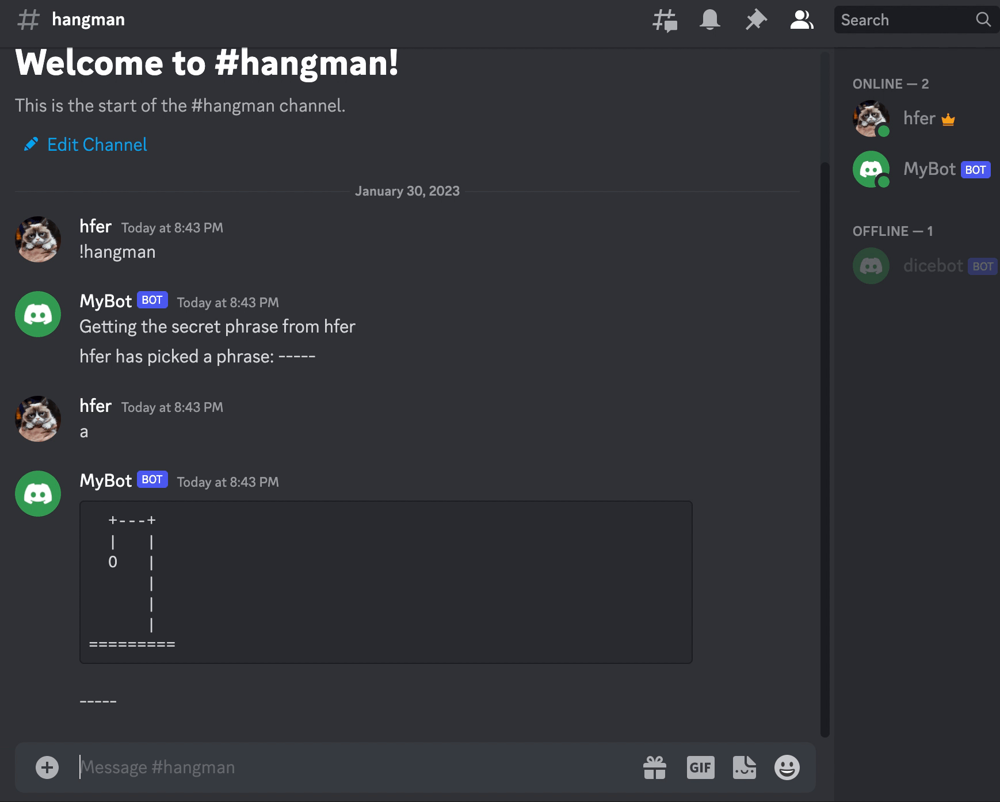

# Hangman-on-Discord

A very simple hangman game you can play on Discord. 



## Setup
Create your python virtual environment and install the necessary libraries.
```
python3 -m venv hangman_venv
source hangman_venv/bin/activate
pip3 install -r requirements.txt
```

Follow the [official Discord developer guide](https://discord.com/developers/docs/getting-started) to understand how to sync this code with your Discord bot.
1. Access the [Discord Developer Portal](https://discord.com/developers/applications) and create a new application, which will be your project. After that, you will be redirected into a bot information page. Fill out the form as you desire and save changes. 
2. Next, navigate to "Bot" on this application and "Add Bot". This officially initializes your bot. Then hit "Reset token" to generate a unique token. Copy and paste this token into `sample.env` and rename it that file to `.env`.
3. In the "Bot" section of the Developer Portal, and you will need to enable some or all intents and give your bot privelleges. It is required by Discord.
4. In the "OAuth2 -> URL Generator" section, generate a link to invite your bot into your server. Check whichever privelleges you want for your bot. In the bottom, copy and paste the URL into your web browser. From here, your bot will be added to your D server.


After everything is setup [(see Discord docs for further help)](https://discord.com/developers/docs/getting-started), and your unique token is pasted into `.env` (renamed from `sample.env`), run `python3 hangman_game.py` in your terminal to wake up your bot. Open Discord to use it.
